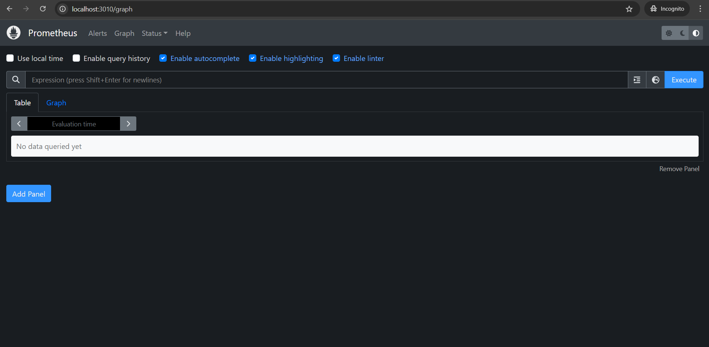
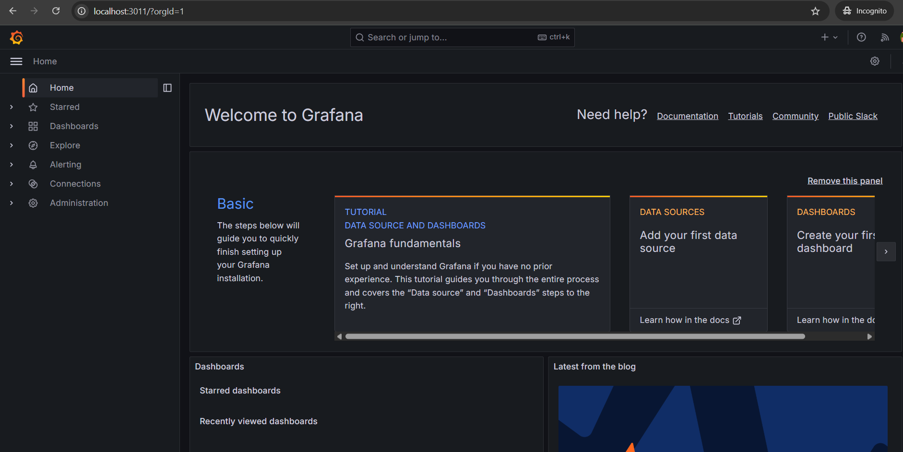
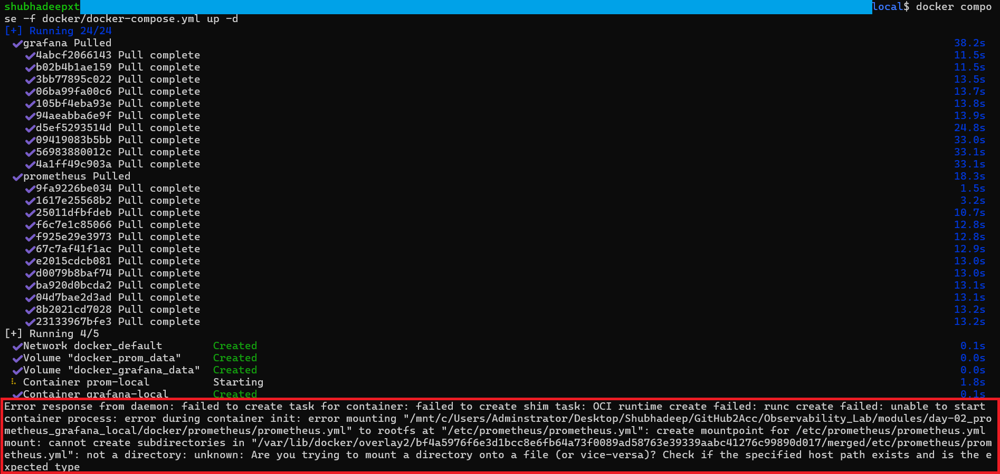
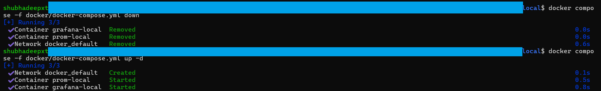
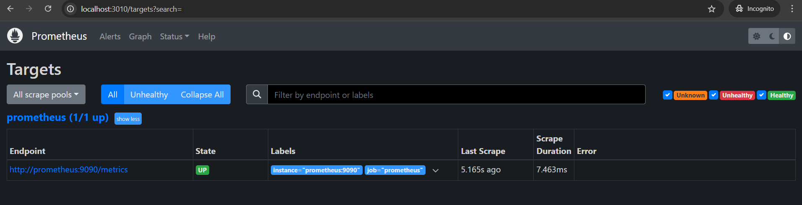

# Day 02 – Prometheus & Grafana Local Installation

## ✅ What we did
- Installed and ran **Prometheus** & **Grafana** locally using **Docker Compose**.
- Configured safe ports:
  - Prometheus → `http://localhost:3010`
  - Grafana → `http://localhost:3011` (login: `admin / prom-operator`)
- Verified Prometheus is scraping itself (`UP` in **Status → Targets**).

---

## 📸 Screenshots

### 1. Prometheus UI


### 2. Grafana UI


### 3. Error Encounter (for learning)


### 3. Docker Compose Startup


### 5. Prometheus Targets (Scraping UP)


---

## 📂 Files in this folder
- `docker/docker-compose.yml` → service definitions
- `prometheus/prometheus.yml` → basic scrape config
- `README.md` → documentation for Day 2
- `screenshots/` → supporting visuals

---

## 🛠️ Troubleshooting
- **Mount error with `prometheus.yml`:**  
  At first, Docker failed to start Prometheus because the `prometheus.yml` file path was incorrect.  
  - **Error:**  
    ```
    error mounting ".../prometheus/prometheus.yml" to rootfs: 
    create mountpoint for /etc/prometheus/prometheus.yml: not a directory
    ```
  - **Fix:**  
    Corrected the file path in `docker-compose.yml`, then ran:
    ```bash
    docker compose down
    docker compose up -d
    ```
    This recreated the containers with the proper configuration, and Prometheus started successfully.
