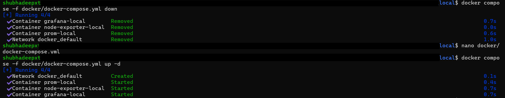

# 📊 Day-03 – Observability with Prometheus, Node Exporter & Grafana

---

## 🔑 Concepts Covered
- Extended **Prometheus setup** from Day-02 by adding **Node Exporter**  
- Learned how Prometheus scrapes metrics (`/metrics` endpoint)  
- Wrote and executed **PromQL queries** (CPU, Memory, Network, etc.)  
- Integrated Prometheus with **Grafana** for visualization  
- Imported a **pre-built Node Exporter dashboard** from Grafana.com  
- Created **custom dashboards** (time-series, histogram, stat, and table panels)  
- Understood how **exporters** (Node Exporter, kube-state-metrics in real clusters) expose metrics  

> ⚡️ Note: We worked **locally with Docker Compose**, not with Kubernetes yet.  
This helps build fundamentals before scaling to EKS / kube-state-metrics.

---

## 🛠️ Setup Changes from Day-02

We reused the same **docker-compose.yml** and **prometheus.yml** from `day-02_prometheus_grafana_local` but **modified** them:

### 1. Added Node Exporter in `docker/docker-compose.yml`
```yaml
  node-exporter:
    image: quay.io/prometheus/node-exporter:v1.8.2
    container_name: node-exporter-local
    restart: unless-stopped
    ports:
      - "9100:9100"
    depends_on:
      - prometheus
```

### 2. Updated prometheus/prometheus.yml to scrape Node Exporter

```
scrape_configs:
  - job_name: 'prometheus'
    static_configs:
      - targets: ['prometheus:9090']

  - job_name: 'node'
    static_configs:
      - targets: ['node-exporter:9100']
```

**✅ Since this repo is version-controlled, you can check Git history to see the exact diff between Day-02 and Day-03.**

---

## 🚀 Step 1: Running the Stack
```
docker compose -f docker/docker-compose.yml down
docker compose -f docker/docker-compose.yml up -d
docker ps --format "table {{.Names}}\t{{.Status}}\t{{.Ports}}"
```

- - **📸 Screenshot:**  
  


## 🔍 Step 2: Verifying Prometheus Targets

- Go to http://localhost:3010/targets
- Both prometheus and node targets should show UP

- - **📸 Screenshot:**
  


## 🧾 Step 3: Raw Metrics from Node Exporter

- Exec into the container and fetch metrics:
```
docker exec -it node-exporter-local wget -qO- http://localhost:9100/metrics | head -20
```
- - **📸 Screenshot:**
  


## 📈 Step 4: Running PromQL Queries

- We ran these queries in Prometheus → Graph UI:

##### 1. CPU Usage (rate of CPU seconds):
	- rate(node_cpu_seconds_total[5m])
- - **📸 Screenshot:**
  

##### 2. Memory Available:
	- node_memory_MemAvailable_bytes
- - **📸 Screenshot:**
  

##### 3. All Node Exporter Metrics:
	- {job="node"}
- - **📸 Screenshot:**
  

##### 4. Network Receive Bytes Rate:
	- rate(node_network_receive_bytes_total[5m])
- - **📸 Screenshot:**
  

##### 5. Average Network Bytes Rate:
	- avg(rate(node_network_receive_bytes_total[5m]))
- - **📸 Screenshot:**
  


## 🎨 Step 5: Grafana Integration

###### 1. Login
```
	URL → http://localhost:3011
	Username → admin
	Password → prom-operator
```

###### 2. Add Prometheus as Data Source

- Go to Connections → Data sources → Add new
- Select Prometheus
- URL: http://prometheus:9090
- Click Save & Test

###### 3. Import Node Exporter Dashboard

- Go to Dashboards → Import
- Use Dashboard ID: 1860
- Select Prometheus datasource → Import
- - **📸 Screenshot:**
  
- - **📸 Screenshot:**
  

###### 4. Build Custom Panels

- We created our own dashboard with different panel types:
- Time Series:
	- avg(rate(node_cpu_seconds_total[5m]))
- - **📸 Screenshot:**
  
- Histogram:
- - **📸 Screenshot:**
  
- Stat:
- - **📸 Screenshot:**
  
- Table:
- - **📸 Screenshot:**
  

---

## ✅ Day-03 Learnings Recap

By the end of Day-03, we understood:  

- How Prometheus scrapes metrics from /metrics endpoints
- The role of Node Exporter in exposing system-level metrics
- How to run PromQL queries (rate, avg, sum)
- How Grafana makes monitoring powerful with dashboards
- The concept of pre-built dashboards vs custom dashboards
- Difference between running locally (our setup) vs in Kubernetes (using kube-state-metrics + node exporter per node)

---

## 📂 Screenshots Reference

- Make sure the following files exist in modules/day-03_prometheus_grafana_node_exporter/screenshots/  
