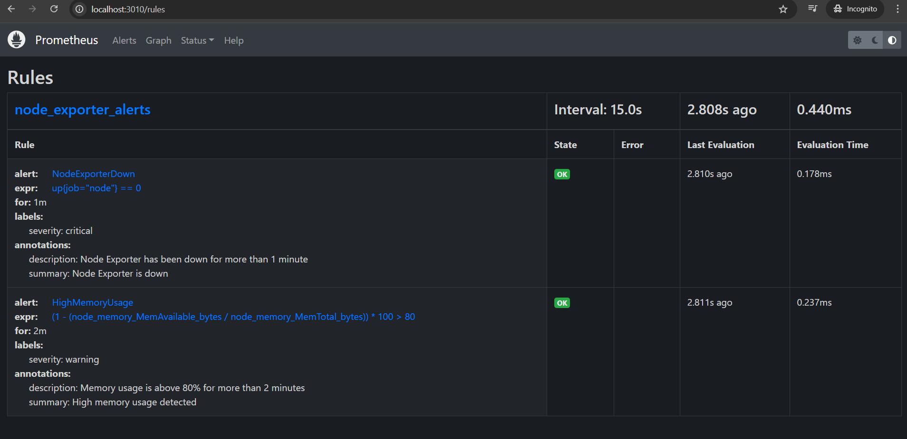
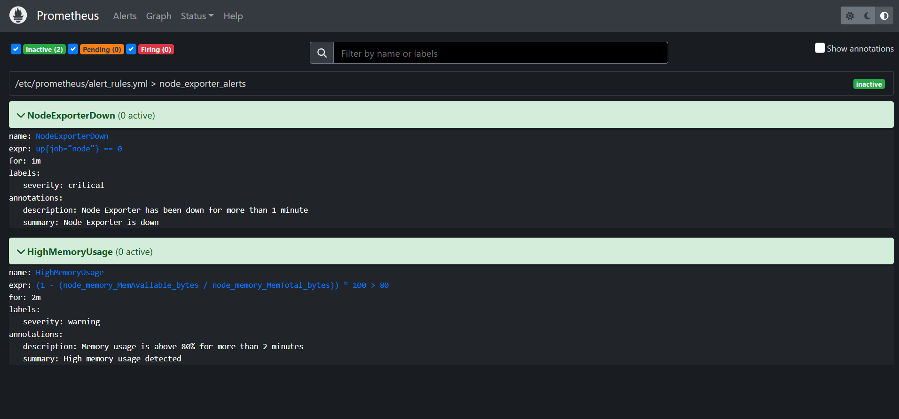
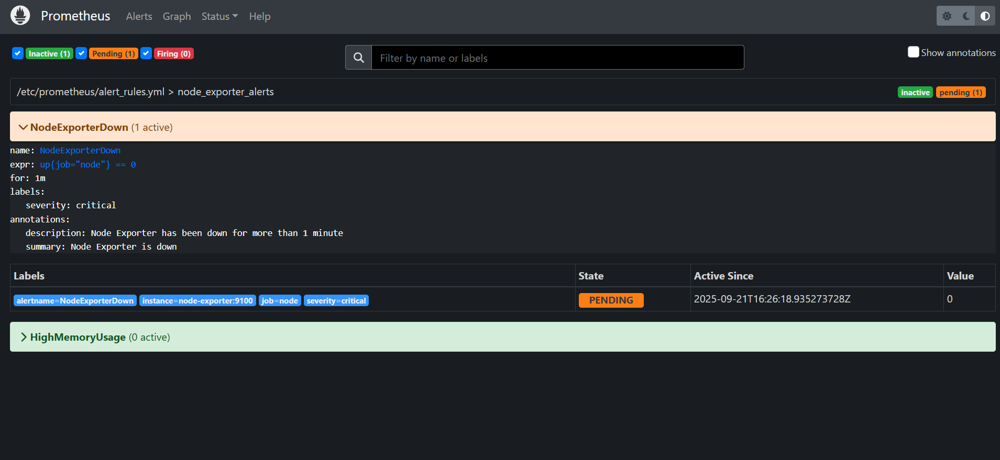
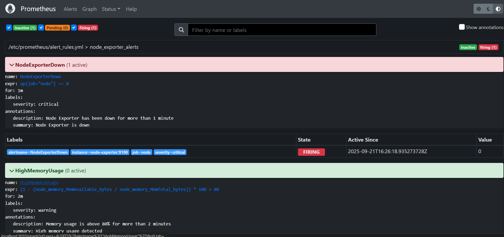
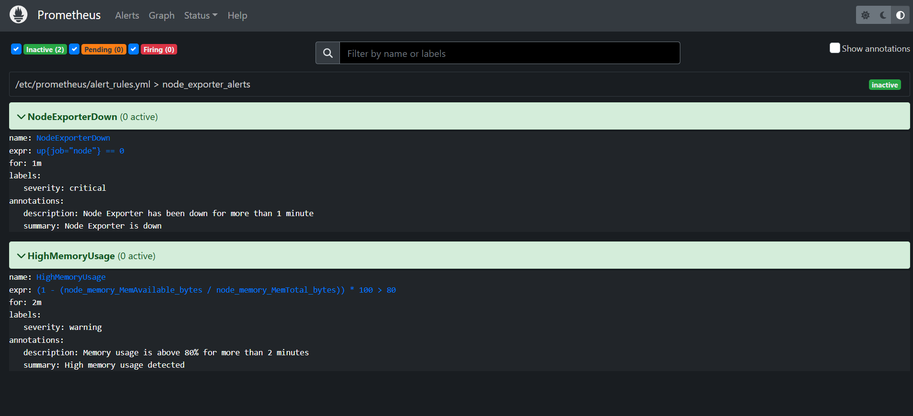

# 🚨 Day-04 – Prometheus Alerting

---

## 🔑 Concepts Covered
- How Prometheus evaluates **alert rules**
- Difference between **Inactive → Pending → Firing → Resolved**
- Writing simple alerts for **Node Exporter** metrics
- Testing alerts by stopping/restarting containers

---

## 🛠️ Setup
We added a new file: `prometheus/alert_rules.yml`

### Example Rules
```yaml
groups:
  - name: node_exporter_alerts
    rules:
      - alert: NodeExporterDown
        expr: up{job="node"} == 0
        for: 1m
        labels:
          severity: critical
        annotations:
          summary: "Node Exporter is down"
          description: "Node Exporter has been down for more than 1 minute"

      - alert: HighMemoryUsage
        expr: (1 - (node_memory_MemAvailable_bytes / node_memory_MemTotal_bytes)) * 100 > 80
        for: 2m
        labels:
          severity: warning
        annotations:
          summary: "High memory usage detected"
          description: "Memory usage is above 80% for more than 2 minutes"
```

### prometheus.yml
rule_files:
  - "/etc/prometheus/alert_rules.yml"

### docker-compose.yml
    volumes:
      - ../prometheus/prometheus.yml:/etc/prometheus/prometheus.yml
      - ../prometheus/alert_rules.yml:/etc/prometheus/alert_rules.yml

---

## 🚀 Testing Alerts

- Start the stack:
```
docker compose up -d
```
- Verify rules loaded:

- Go to http://localhost:3010  
 	→ Status → Rules

- 


## Alerts tab (initial state = Inactive):
- 

## Trigger NodeExporterDown:
```
docker stop node-exporter-local
```

## Watch alert transition: Inactive → Pending → Firing

-   

-   

## Resolve:
```
docker start node-exporter-local
```

## Alert moves back to Resolved/Inactive

- 

## Trigger HighMemoryUsage:
(Simulated with stress tool or artificial memory pressure if needed)

---

## ✅ Day-04 Learnings

- Prometheus alerts follow lifecycle: Inactive → Pending → Firing → Resolved
- Rules are written in YAML, loaded via rule_files
- Alerts can be tested locally by stopping exporters
- This completes the metrics → visualization → alerting workflow

---

## 📂 Folder Structure
```
modules/day-04_basic_alerting/
├── docker/
│   └── docker-compose.yml
├── prometheus/
│   ├── prometheus.yml
│   └── alert_rules.yml
├── screenshots/
│   ├── 01_alert_rules_loaded.png
│   ├── 02_alert_inactive.png
│   ├── 03_alert_pending.png
│   ├── 04_alert_firing.png
│   ├── 05_alert_resolved.png
│   └── 06_memory_alert_firing.png
└── README.md
```
